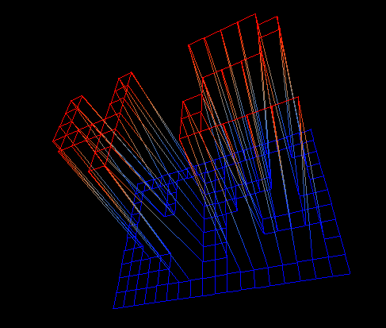

# fdf (UNIT)
It is my first graphic project, which I developed for my learning course at UNIT.
It is a simple 3D height-map renderer.

### Subject: [fdf.en.pdf][1]
### Maps: [test_maps.zip][2]

### Requirements
- linux or macos
- installed minilibx
- libx11-dev and libxext-dev for linux
- framework OpenGL and framework AppKit for mac

### How does it work?
	make
	./fdf [map file]

[1]: https://github.com/vtiterin/fdf/blob/master/fdf.en.pdf
[2]: https://github.com/vtiterin/fdf/blob/master/test_maps.zip
